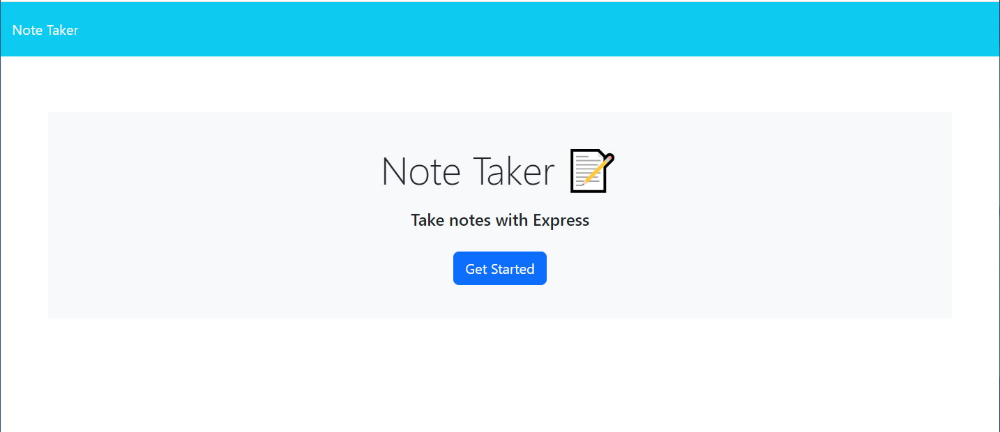
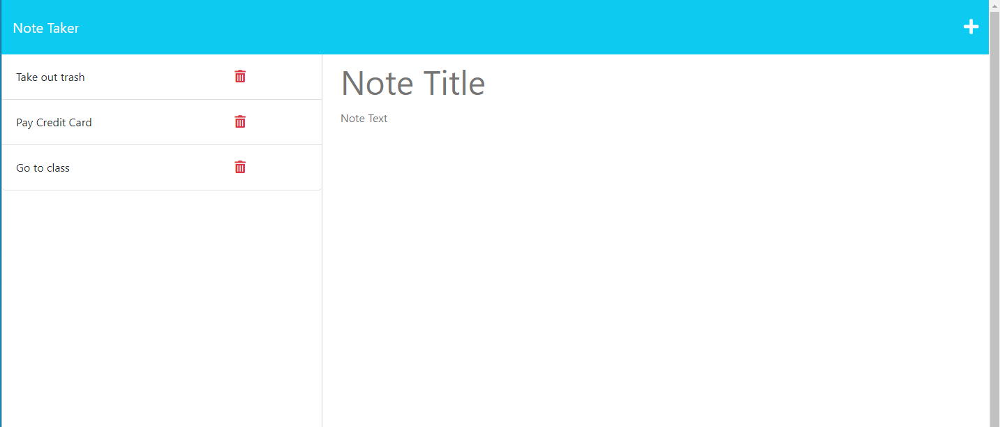

# Note_Taker

## Description

AS A small business owner I WANT to be able to write and save notes SO THAT I can organize my thoughts

When I open the application I am presented with a landing page that links to a notes page.  On this notes page I can enter a note that can be saved and it will show up on the left hand side.  One can then view past notes and bring them back to the right hand side for a deeper review.

## Installation

In order to use the app there are no installation instructions - one can simply navigate to https://notes-app-618.herokuapp.com/ and begin using the app by clicking on "Get Started'

This will take you to the notes page where you can begin entering and retrieving notes.

## Usage

One can use this app as a way to stay on track and take notes that will be beneficial to productivity.  When you login to the app at https://notes-app-618.herokuapp.com/ you are brought to a home landing page that allows you to jump to the notes page by clicking on 'Get Started'.

Once on the notes page one can simply create a "Note Title" and add "Note Text".  Save the note by clicking the plus symbol in the upper right hand corner.  When you click the plus button the note will get added to the left hand side of the screen.

If you want to retreive the note you can click on the note you'd like to see and it will bring it back to the right hand column for more details on your note.

## Credits

U of M Class work - Activities 01 through 28
expressjs.com

## License

MIT License

Copyright (c) 2023 swmcguire

Permission is hereby granted, free of charge, to any person obtaining a copy
of this software and associated documentation files (the "Software"), to deal
in the Software without restriction, including without limitation the rights
to use, copy, modify, merge, publish, distribute, sublicense, and/or sell
copies of the Software, and to permit persons to whom the Software is
furnished to do so, subject to the following conditions:

The above copyright notice and this permission notice shall be included in all
copies or substantial portions of the Software.

THE SOFTWARE IS PROVIDED "AS IS", WITHOUT WARRANTY OF ANY KIND, EXPRESS OR
IMPLIED, INCLUDING BUT NOT LIMITED TO THE WARRANTIES OF MERCHANTABILITY,
FITNESS FOR A PARTICULAR PURPOSE AND NONINFRINGEMENT. IN NO EVENT SHALL THE
AUTHORS OR COPYRIGHT HOLDERS BE LIABLE FOR ANY CLAIM, DAMAGES OR OTHER
LIABILITY, WHETHER IN AN ACTION OF CONTRACT, TORT OR OTHERWISE, ARISING FROM,
OUT OF OR IN CONNECTION WITH THE SOFTWARE OR THE USE OR OTHER DEALINGS IN THE
SOFTWARE.
---
